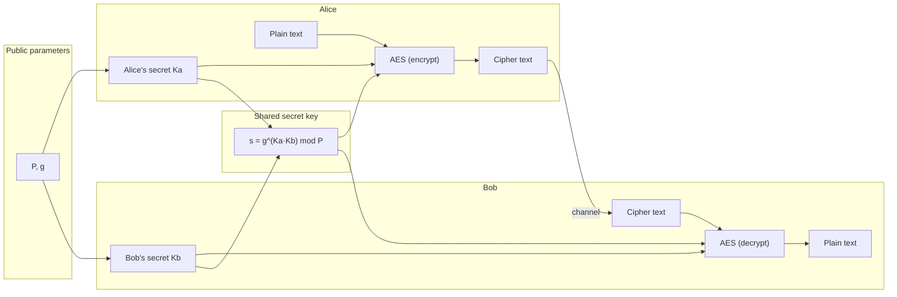
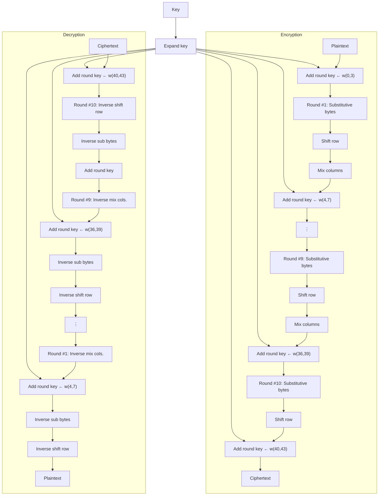

# CSE 406 — Cyber Security Sessional
**January 2026**
**Assignment 01**

The goal of this assignment is to implement a cryptosystem that uses a symmetric key for encryption and decryption. The symmetric key is securely shared between the two parties using the Diffie–Hellman key exchange method over a finite field.

You are not required to derive the underlying finite-field (Galois field) mathematics from scratch. For the AES task, the field-arithmetic building blocks are provided to you in `aes_helpers.py` (see Task 1). The key exchange uses ordinary modular arithmetic, so the only "hard" operation you need is fast modular exponentiation. Concentrate your effort on the structure of the algorithms and on getting the core ideas right.

## Overview of the cryptosystem

As shown in the figure below, the sender and receiver first agree on a shared secret key using Diffie–Hellman. The sender uses this key to encrypt the plaintext with AES. The AES ciphertext is then sent over any communication channel. Finally, the receiver uses the same shared key to perform AES decryption of the ciphertext.



## Overview of AES

The Advanced Encryption Standard (AES) is a popular and widely adopted symmetric-key encryption algorithm. AES uses repeated cycles, or "rounds." There are 10, 12, or 14 rounds for keys of 128, 192, and 256 bits, respectively. In this assignment you will implement **AES-128 (10 rounds)**.

Each round of the algorithm consists of four steps:

1. **subBytes**: For each byte in the state, use its value as an index into a fixed 256-element lookup table and replace it with the stored value. The table (`Sbox`) and its inverse (`InvSbox`) are provided in `aes_helpers.py`.

2. **shiftRows**: Let R_i denote the i-th row of the state (4 × 4 matrix). For encryption, circularly shift R0 left by 0 bytes, R1 by 1, R2 by 2, and R3 by 3 bytes. Shift right for decryption. The byte values themselves are unchanged.

3. **mixColumns**: Replace each column of the state by its product with a fixed 4 × 4 matrix over the Galois field GF(2⁸). **You do not need to implement the field arithmetic.** Use the provided `gf_mult(a, b)` together with the `Mixer` / `InvMixer` matrices from `aes_helpers.py`.

4. **addRoundKey**: XOR the state with the 128-bit round key derived from the original key `K` by the key-expansion (key-schedule) process. The round constants (`Rcon`) are provided.

The final round omits the `mixColumns` step. Decryption applies the inverse steps in the appropriate order. Refer to the AES diagram below for a visual overview of the algorithm.



**Figure 1:** Overview of the AES algorithm.

**What is provided to you.** The file `aes_helpers.py` contains all the finite-field machinery so you can focus on the cipher structure:

```python
from aes_helpers import Sbox, InvSbox, Rcon, Mixer, InvMixer, gf_mult
# Example: one entry of a mixColumns output column
# out0 = gf_mult(Mixer[0][0], c0) ^ gf_mult(Mixer[0][1], c1) ^ ...
```

You must still implement `subBytes`, `shiftRows`, `mixColumns` (using the helper), `addRoundKey`, the key schedule, the two modes of operation, and padding yourself.

## Overview of Diffie–Hellman key exchange

Diffie–Hellman lets two parties agree on a shared secret over a public channel. It relies on the difficulty of the discrete logarithm problem: given g^x mod P it is hard to recover x.

1. The two parties publicly agree on a large prime modulus P and a base (generator) g with 1 < g < P.
2. Alice chooses a secret random number Ka and computes A = g^Ka mod P, then sends A to Bob.
3. Bob chooses a secret random number Kb and computes B = g^Kb mod P, then sends B to Alice.
4. Alice computes s = B^Ka mod P.
5. Bob computes s = A^Kb mod P.

Both values equal g^(Ka·Kb) mod P, so they are identical — this is the shared secret. We use it as the AES key. Because AES keys must be 128, 192, or 256 bits, we take the bit length k as a parameter. The modulus P must be at least k bits long, and we keep Ka and Kb at least k bits long as well. Derive the k-bit AES key from s (for example, take the low k bits of s, or hash s and truncate — state which approach you use).

## Tasks

### Task 1: Independent Implementation of (128-bit) AES [40]

1. The encryption key is provided by the user as an ASCII string of 16 characters (128 bits). Your program should also handle keys of other lengths (you may pad or truncate — you must justify your approach during evaluation). Implement the key-scheduling algorithm.
2. Implement both ECB and CBC modes, each with the PKCS#7 padding scheme for text input:
   - (a) **ECB**: encrypt each 128-bit block independently.
   - (b) **CBC**: XOR each plaintext block with the previous ciphertext block before encryption; use a randomly generated Initialization Vector (IV) for the first block.
3. **Encryption**: split the plaintext into 128-bit blocks and encrypt. If the last block is short, complete it with the padding scheme above.
4. **Decryption**: decrypt the blocks, remove the padding, and confirm that the recovered text matches the original — for both modes.
5. Report time-related performance (key-schedule, encryption, and decryption time) in your output.

**N.B.**

1. For CBC, the ciphertext output is the concatenation of the randomly generated IV (first 16 bytes) followed by the actual ciphertext. Your IV will differ on each run.
2. For ECB, no IV is used — this is intentional, and you will see why in the bonus task.
3. Execution time will vary with your implementation.
4. Your output must clearly label the mode (ECB / CBC) and show the key, plaintext, ciphertext, and recovered plaintext in both ASCII and HEX. Avoid printing excessive extra text.

### Task 2: Independent Implementation of Diffie–Hellman [25]

1. Generate the public parameters P and g.
   - (a) Generate a random prime P whose bit length matches the chosen key size k (128, 192, or 256). You may repeatedly generate a random odd k-bit number and test whether it is prime using the Miller–Rabin primality test, until a suitable prime P is found.
   - (b) Once a suitable prime P is found, choose a candidate generator g with 1 < g < P such that g^((P−1)/r) ≢ 1 (mod P) for every prime factor r of P − 1.
   - (c) You may use a fixed random seed so that your output is reproducible.
2. Generate private and public values for Alice and Bob.
   - (a) Choose a secret random Ka (≥ k bits) and compute A = g^Ka mod P.
   - (b) Choose a secret random Kb (≥ k bits) and compute B = g^Kb mod P.
3. Compute the shared secret s = B^Ka mod P = A^Kb mod P and verify both sides agree.
4. You may use Python packages for prime and random number generation only. (Python's built-in `pow(base, exp, mod)` for fast modular exponentiation is allowed and encouraged.)
5. Report time-related performance in the format below. Take an average of at least 5 trials.

| k   | Computation time for A | Computation time for B | Computation time for shared key s |
|-----|-------------------------|-------------------------|-------------------------------------|
| 128 |                         |                         |                                      |
| 192 |                         |                         |                                      |
| 256 |                         |                         |                                      |

### Task 3: Implementation of the Whole Cryptosystem [20]

Demonstrate the sender and receiver using TCP socket programming. Suppose ALICE is the sender and BOB is the receiver. They first agree on a shared secret key: ALICE sends P, g, and A = g^Ka mod P to BOB. BOB replies with B = g^Kb mod P. Both compute the shared secret, store it, and signal that they are ready for transmission. ALICE then sends the AES-encrypted ciphertext (CT) to BOB over the socket, and BOB decrypts it using the shared secret key.

## Bonus Tasks

1. **ECB vs. CBC on an image.** Encrypt the same image with both ECB and CBC modes and display the two encrypted results side by side (treat the raw pixel bytes as the plaintext; keep any header bytes intact so the result is viewable). You should observe that the ECB ciphertext still reveals the outline of the original image, while the CBC ciphertext looks like random noise. Briefly explain in your report why. You should use a small image (for example, 64×64 pixels) so that the output is manageable. **[5]**
2. **Other file types.** Extend AES to encrypt/decrypt arbitrary files (image, PDF, etc.) with proper padding, and transfer them over the socket in Task 3. Encrypting/decrypting files alone earns partial credit. **[5]**
3. **Larger keys.** Generalize your AES implementation to support 192- and 256-bit keys. **[5]**

## Breakdown of Marks

| Task                                                                  | Marks |
|------------------------------------------------------------------------|-------|
| Independent Implementation of AES (ECB + CBC, PKCS#7 padding)          | 40    |
| Independent Implementation of Diffie–Hellman key exchange              | 25    |
| Implementation of the whole cryptosystem using sockets                 | 20    |
| Viva                                                                    | 10    |
| Correct Submission                                                      | 5     |
| Bonus: ECB vs. CBC image comparison                                     | 5     |
| Bonus: AES with other file types                                        | 5     |
| Bonus: AES with 192- and 256-bit keys                                   | 5     |

## Submission Guidelines

1. Create a directory named by your seven-digit student ID `<2005XXX>`.
2. Rename the source file to your student ID `<2005XXX.py>`. If you have multiple files, use `<2005XXX_aes.py>`, `<2005XXX_dh.py>`, etc. Place them in the directory from step 1. Do not include the provided `aes_helpers.py` in a way that overwrites the evaluator's copy — import it as given.
3. Zip the directory and name it `<2005XXX.zip>`.
4. Submit the zip file only.
5. N.B. You may need `importlib` to import files with a numeric prefix.

## Deadline

The deadline for submission is **11:59 PM on 3 July 2026**.

